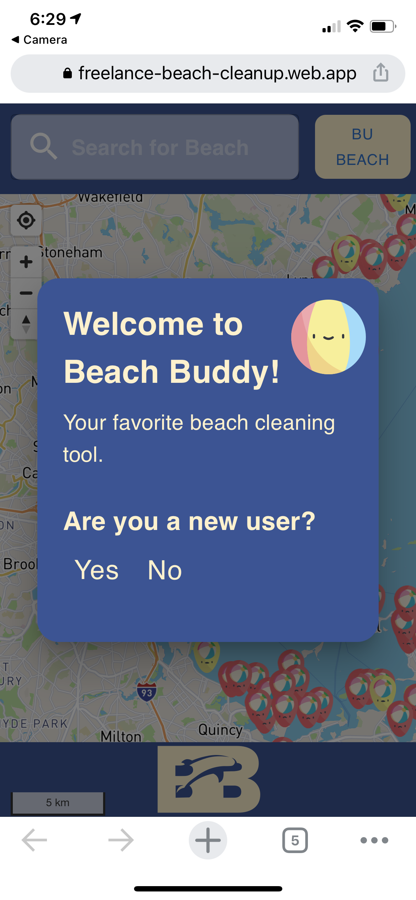
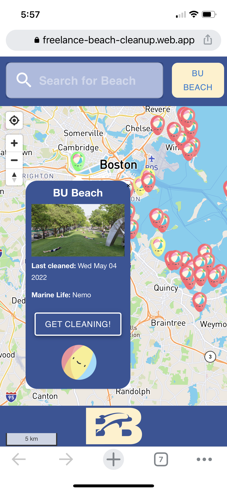
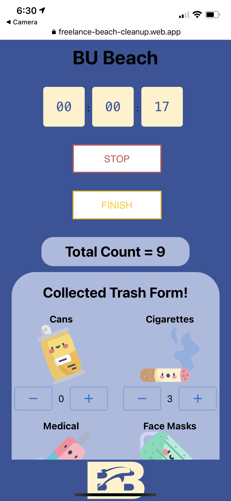
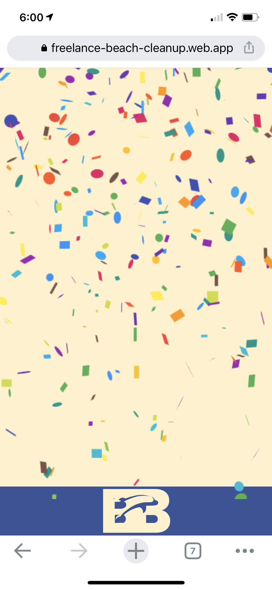
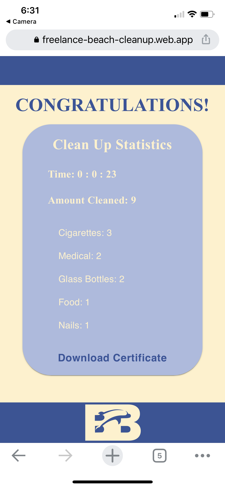
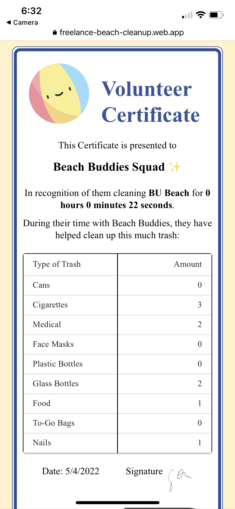

### Beach Buddies 🏖️

Our project is a web, iOS, and Android app that provides opportunities for volunteers to protect the beach, ocean, and environment, as well as allowing individuals to gain service hours automatically!

Check out our site! [Beach Buddies](https://freelance-beach-cleanup.web.app/)









# Running the code:

## Installation
In freelance-beach-cleanup/ run:
```bash
npm install
```

## Getting Started

Run the development server in freelance-beach-cleanup/:

```bash
npm run start
# or
yarn start
# or 
yarn run build then server -s build
```

## Viewing the web page

Open [http://localhost:3000](http://localhost:3000) with your browser to see the result.

## Deploy

Merge your code into branch "main" and create a pull request or merge into branch "prod".
